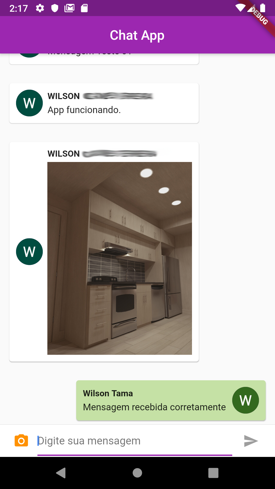

# Chat Online - Android

App de Chat Online usando Firebase.

Projeto 7 do curso [Criação de Apps Android e iOS com Flutter](https://www.udemy.com/curso-completo-flutter-app-android-ios/)

# Adições originais

- Exibição das mensagens em formato de card;
- Salva Id do usuário no banco de dados;
- Checa o ID para exibir as mensagens com formato e cor diferenciados;
- Login movido para o momento que o APP for aberto, para que o estilo das mensagens seja aplicado de imediato;

